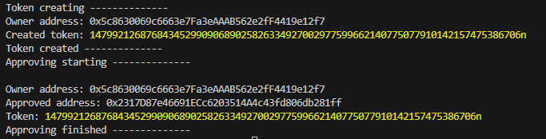

# Обучение Solidity. Задача 2

Контракт для создания NFT в соответствии со стандартом ERC-721

Цель:
Написать контракт для создания NFT в соответствии со стандартом ERC-721

Описание/Пошаговая инструкция выполнения домашнего задания:

1. Создайте свой токен ERC20, используя Remix IDE и Solidity. Опубликуйте этот контракт на тестовой сети Ethereum.

2. Напишите контракт для создания NFT в соответствии со стандартом ERC-721. Опционально, вы можете создать и свой токен по стандарту ERC-1155.
Изучите уязвимости в контрактах токенов. Для более глубокого понимания, попытайтесь идентифицировать и исправить потенциальные уязвимости в своих собственных контрактах токенов.
Созданный вами контракт должен быть протестирован (минимальным набором тестов).

Код должен быть размещен в системе контроля версий (Github, Gitlab, etc.).

## Результат работы:

### Контракт токен ERC20:
https://amoy.polygonscan.com/address/0x6f05a50BA60A419F0E3AAFefaA2DE296a0911EcE
1. Сделан и выполнен скрипт useApproveForERC720.ts, который вызывает функцию approve на контракте по ссылке выше.
2. Совершена транзакция https://amoy.polygonscan.com/tx/0xb90c013d04bee97f71f2b4210c9f8feec87789f55b6ece69c7077f25dbf1fea6
3. Проверить транзакцию можно запустив скрипт checkApprovedForERC20.ts

### Контракт токен ERC-721:
~~https://amoy.polygonscan.com/address/0xc43BC2ad9D23B48e865d21F94427B8410571635b~~
Переделал контракт. Добавил в mint событие, а то не получалось вытащить номер токена. Есть ошибка в названии функции надо было назвать safeMint, назвал saveMint, не стал исправлять и передеплоивать.
https://amoy.polygonscan.com/address/0x38E8a2a03BF9BF54aBF3Add1DEFCd31E4b822df3
1. В скрипте mintERC721Token.ts создается новый токен и сразу выдается approve на адрес 0x2317D87e46691ECc6203514A4c43fd806db281ff. Ниже изображение вывода консоли при запуске скрипта в крайний раз.
